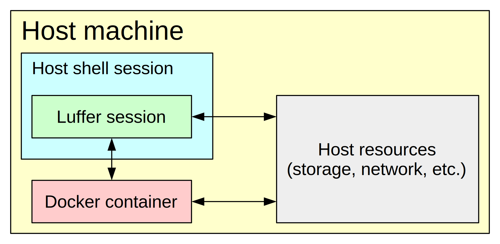

# Luffer

Luffer is a tool to create isolated environments for software development and execution. Containers are seamlessly integrated to the host environment as they are instantiated, making possible to keep project files and general-purpose applications (such as text editor and version control clients) on the host, while project-specific tools and files are stored in the image. Multiple development environments with otherwise conflicting dependencies can therefore coexist on the same host.

## Dependencies

* [BASH](https://www.gnu.org/software/bash/) >= 4.0
* [Docker](https://www.docker.com/) >= 1.0
* [screen](https://www.gnu.org/software/screen/) >= 4.0

## Install

Clone the project repository, then run the included `./install.sh` script. It will copy script and configuration files to `~/.luffer` and create a symlink from `~/.luffer/luffer.sh` to `~/bin/luffer`. If the later directory isn't in the user's `$PATH`, the script will offer to add it in the user's `~/.bashrc` file.

## Usage

Luffer includes some conveniences for setting up custom Docker images. Use `luffer root` To create a container from a pre-existing image and enter a shell session on it, for example:

    $ luffer root ubuntu:17.04

This will create a container from the `ubuntu:17.04` image (downloading it from Docker's repository if not yet available) and start a shell session on it logged to the root user. Additionally the host's current folder will be mapped to the instance, so files can be easily exchanged between the two. Package installation and other customizations can be performed in the usual manner, for example to install Jupyter Notebook type:

    $ apt-get update
    $ apt-get install python3-pip
    $ pip3 install jupyter

Once you're done with your modifications type `exit` to stop the container, then commit it to a new image with `luffer commit`, for example:

    $ luffer commit python:3

This will create an image with name `python` and version `3`. This can then be plugged to your current environment using the `luffer plug` command:

    $ luffer plug python:3

This will instantiate a container for the given image on the background and run `screen` on the host. All tabs created in this session will be able to send commands to the running container through the `luffer exec` command:

    (python:3) $ luffer exec jupyter notebook

New screen tabs can be created by typing `Ctrl+a c` (i.e. first type `Ctrl+a`, then release the keys and type `c`). Use `Ctrl+a n` (for "next) and `Ctrl+a p` (for "previous") to move along tabs. As with `luffer root` the host's current folder is mapped to the instance, so it can access all files on it and its subfolders (but not any parent folders).

To unplug the image, simply `exit` from all screen tabs.

Preceding commands with `luffer exec` can be tiresome and error-prone. To add aliases to those commands that should always be sent to the plugged instance, create a `host.bashrc` file inside a `<image name>/<image version>` subfolder of Luffer's base folder (i.e. the folder where Luffer scripts are located), then include appropriate `alias` entries in that file. For example:

    $ mkdir -p ~/bin/luffer/python/3
    $ echo "alias jupyter='luffer exec jupyter'" > ~/bin/luffer/python/3/host.bashrc

Now the next time the `python:3` image is plugged to the host environment, `jupyter` will automatically resolve to `luffer exec jupyter`:

    $ luffer plug python:3
    (python:3) $ type jupyter
    jupyter is aliased to `luffer exec jupyter'
    (python:3) $ jupyter notebook

The last command will be equivalent to `luffer exec jupyter notebook`.

## Trivia

A [level luffing crane](https://en.wikipedia.org/wiki/Level_luffing_crane) is a type of crane often seen on the docks of industrial harbors, where they are used to load and unload ships. Luffer's name and logo take inspiration in their iconic shapes.

